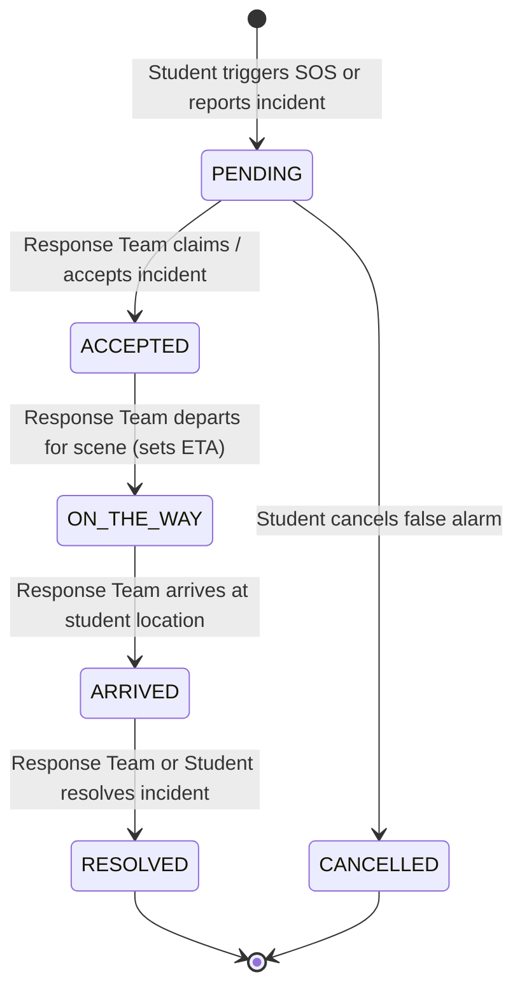

# RESQ – Team Integration & Backend Handoff Guide

> **System**: RESQ – Emergency & Rapid Response Management System  
> **Subsystem**: User / Student Application (Completed)  
> **Target Audience**: Response Team Developer & Admin Dashboard Developer  

---

## 1. Project Architecture & Directory Structure

- **Django Project Name**: `safecampus_project`
- **Django Application Name**: `safety_app`
- **Root Directory**: `c:\RESQ\`

```text
c:\RESQ\
├── manage.py
├── safecampus_project/          # Django project configuration
│   ├── __init__.py
│   ├── settings.py              # Installed apps, DB, static & media settings
│   ├── urls.py                  # Root URL router
│   ├── asgi.py
│   └── wsgi.py
├── safety_app/                  # Core emergency & safety application
│   ├── models.py                # Shared database models (Incident, UserProfile, etc.)
│   ├── views.py                 # Views & REST JSON endpoints
│   ├── urls.py                  # Application route definitions
│   ├── forms.py                 # Django forms & validation
│   ├── admin.py                 # Django admin registration & actions
│   ├── apps.py                  # SafetyAppConfig
│   ├── migrations/              # Database migration files
│   └── static/                  # Shared static assets (CSS, JS, audio)
│       ├── css/
│       │   ├── main.css         # Tactical design system & CSS reset
│       │   └── components.css   # Command center, radar, SOS ring
│       └── js/
│           ├── main.js          # Audio FX, accessibility, toasts
│           ├── sos.js           # 2-second press & hold SOS engine
│           ├── location.js      # GPS capture & campus landmarks
│           └── tracker.js       # Real-time status polling engine
├── templates/                   # Django HTML templates
│   ├── base.html                # Global app shell & header
│   ├── dashboard.html           # Student Emergency Command Center
│   ├── auth/                    # Login & Registration
│   ├── incidents/               # Report, My Reports, Live Tracking
│   ├── location/                # Dedicated Location & Radar
│   ├── contacts/                # Emergency Contacts & Speed Dial
│   ├── profile/                 # Student Profile & Medical Info
│   └── settings/                # Accessibility & Display Settings
├── media/                       # Uploaded incident photos
├── db.sqlite3                   # Shared development database
├── TEAM_INTEGRATION.md          # This integration contract
└── .gitignore                   # Clean Git tracking configuration
```

---

## 2. Shared Database Configuration

All three applications (Student, Response Team, and Admin) share **one unified database**.
- **Engine**: `django.db.backends.sqlite3` (Development) / PostgreSQL-ready
- **Database File**: `db.sqlite3`
- **Database Tables**:
  - `safety_app_incident`: All emergency SOS and incident reports
  - `safety_app_incidentstatuslog`: Complete audit trail of status changes
  - `safety_app_userprofile`: Extended student profiles and medical data
  - `safety_app_emergencycontact`: Campus hotlines and personal ICE contacts
  - `auth_user`: Standard Django user authentication

---

## 3. Data Models & Field Specifications

### A. `Incident` Model (`safety_app/models.py`)

The primary model used by all three applications:

| Field Name | Type | Constraints / Choices | Description |
|---|---|---|---|
| `id` | `AutoField` | Primary Key | Unique incident ID |
| `user` | `ForeignKey(User)` | `on_delete=CASCADE`, `related_name='incidents'` | The student who reported the incident |
| `incident_type` | `CharField(30)` | Choices: `EMERGENCY`, `MEDICAL`, `ACCIDENT`, `FIRE`, `PHYSICAL_THREAT`, `SUSPICIOUS`, `INFRASTRUCTURE`, `OTHER` | Type of incident |
| `description` | `TextField` | `blank=True` | Situation details |
| `location_name` | `CharField(255)` | Default: `"Main Campus Grounds"` | Campus landmark or room description |
| `latitude` | `FloatField` | `null=True, blank=True` | GPS Latitude coordinate |
| `longitude` | `FloatField` | `null=True, blank=True` | GPS Longitude coordinate |
| `urgency` | `CharField(15)` | Choices: `LOW`, `MEDIUM`, `HIGH`, `CRITICAL` | Priority level (SOS defaults to `CRITICAL`) |
| `status` | `CharField(20)` | Choices: `PENDING`, `ACCEPTED`, `ON_THE_WAY`, `ARRIVED`, `RESOLVED`, `CANCELLED` | Current response lifecycle status |
| `image` | `ImageField` | `upload_to='incidents/'`, `null=True, blank=True` | Optional incident photograph |
| `response_team_name` | `CharField(120)` | `null=True, blank=True` | Assigned unit (e.g. `"Campus Police Unit 4"`) |
| `responder_notes` | `TextField` | `null=True, blank=True` | Notes sent to student by response team |
| `eta_minutes` | `PositiveIntegerField` | `null=True, blank=True` | Estimated arrival time in minutes |
| `is_sos` | `BooleanField` | Default: `False` | `True` if triggered via SOS button |
| `created_at` | `DateTimeField` | `auto_now_add=True` | Timestamp when broadcasted |
| `updated_at` | `DateTimeField` | `auto_now=True` | Timestamp of last status change |
| `resolved_at` | `DateTimeField` | `null=True, blank=True` | Timestamp when marked resolved |

### B. `IncidentStatusLog` Model (`safety_app/models.py`)

Audit log generated automatically every time an incident's status updates:

| Field Name | Type | Description |
|---|---|---|
| `incident` | `ForeignKey(Incident)` | Parent incident record |
| `status` | `CharField(20)` | Status at this log point |
| `note` | `TextField` | Audit description or responder note |
| `updated_by` | `CharField(120)` | Name/username of user or system unit |
| `created_at` | `DateTimeField` | Timestamp of log event |

### C. `UserProfile` Model (`safety_app/models.py`)

Extended student medical & emergency data:

| Field Name | Type | Description |
|---|---|---|
| `user` | `OneToOneField(User)` | Associated Django auth user |
| `student_id` | `CharField(50)` | Campus roll / student ID (e.g. `"SC-84920"`) |
| `phone_number` | `CharField(25)` | Emergency contact mobile phone |
| `dormitory_block` | `CharField(100)` | Student residence hall and room |
| `blood_group` | `CharField(5)` | Choices: `A+`, `A-`, `B+`, `B-`, `AB+`, `AB-`, `O+`, `O-` |
| `medical_allergies` | `TextField` | Allergies, chronic conditions, medications |
| `emergency_notes` | `TextField` | Special responder notes (e.g. inhaler, wheelchair access) |

---

## 4. Incident Lifecycle & Integration Contract



### Standard Status State Machine

| Status Constant | Display Label (Student UI) | Triggered By | Action / Meaning |
|---|---|---|---|
| **`PENDING`** | "Waiting for response" | Student | Incident created in SQLite. Appears in Response Team dispatch queue. |
| **`ACCEPTED`** | "Team accepted" | Response Team | Responder accepts ticket; assigns `response_team_name`. |
| **`ON_THE_WAY`** | "Team on the way" | Response Team | Responders in transit; sets `eta_minutes` and optional `responder_notes`. |
| **`ARRIVED`** | "Team arrived" | Response Team | First responders on scene contacting the student. |
| **`RESOLVED`** | "Emergency resolved" | Response Team / Student ("I'm Safe") | Emergency concluded; sets `resolved_at = timezone.now()`. |
| **`CANCELLED`** | "Cancelled" | Student | Cancelled before responder acceptance. |

---

## 5. Endpoints & API Reference

### Student Endpoints (Already Implemented & Working)

| Method | Endpoint / Route | Auth Required | Purpose |
|---|---|---|---|
| `GET` | `/` | `@login_required` | Student Command Center Dashboard |
| `GET` | `/login/` | Anonymous | Student & Staff Sign-in |
| `POST` | `/login/` | Anonymous | Session Authentication |
| `GET` | `/register/` | Anonymous | Student Registration |
| `GET` | `/logout/` | `@login_required` | Session Logout |
| `POST` | `/api/sos/trigger/` | `@login_required` | 2-Second SOS Dispatch (`lat`, `lng`, `location_name`) |
| `POST` | `/api/incidents/sos/` | `@login_required` | Alias for SOS Trigger |
| `POST` | `/report/` | `@login_required` | Normal Incident Report Form |
| `GET` | `/my-reports/` | `@login_required` | Student's Incident History Feed |
| `GET` | `/incidents/<id>/` | `@login_required` | Student Response Tracker Page |
| `GET` | `/incidents/<id>/status/` | `@login_required` | Status Polling JSON (polled every 2.5s by student) |
| `POST` | `/incidents/<id>/safe/` | `@login_required` | "I'M SAFE" Student Acknowledgement |
| `GET` | `/location/` | `@login_required` | Dedicated Campus Location & Radar |
| `GET` | `/contacts/` | `@login_required` | Emergency Speed-Dial Contacts |
| `GET` | `/profile/` | `@login_required` | Profile & Medical Information Form |
| `GET` | `/settings/` | `@login_required` | Accessibility & Theme Settings |

### Recommended Endpoints for Response Team Teammate

| Method | Proposed Endpoint | Purpose |
|---|---|---|
| `GET` | `/response/queue/` | View all active/pending incidents (`status__in=['PENDING', 'ACCEPTED', 'ON_THE_WAY']`) |
| `POST` | `/response/incidents/<id>/accept/` | Set `status = 'ACCEPTED'`, `response_team_name = team_name` |
| `POST` | `/response/incidents/<id>/dispatch/` | Set `status = 'ON_THE_WAY'`, `eta_minutes = X` |
| `POST` | `/response/incidents/<id>/arrived/` | Set `status = 'ARRIVED'` |
| `POST` | `/response/incidents/<id>/resolve/` | Set `status = 'RESOLVED'`, `resolved_at = now()` |

---

## 6. How the Response Team Teammate Should Connect

1. **Import the Shared Model**:
   ```python
   from safety_app.models import Incident, IncidentStatusLog
   ```
2. **Fetch Active Incidents**:
   ```python
   pending_incidents = Incident.objects.filter(status='PENDING').order_by('-urgency', '-created_at')
   active_incidents = Incident.objects.filter(status__in=['ACCEPTED', 'ON_THE_WAY', 'ARRIVED'])
   ```
3. **Update Status & Create Audit Log**:
   ```python
   def accept_incident(incident_id, responder_team_name, user):
       incident = Incident.objects.get(id=incident_id)
       incident.status = 'ACCEPTED'
       incident.response_team_name = responder_team_name
       incident.save()
       
       IncidentStatusLog.objects.create(
           incident=incident,
           status='ACCEPTED',
           note=f'Accepted by {responder_team_name}',
           updated_by=user.get_full_name() or user.username
       )
   ```
4. **Student Real-Time Sync**: The Student tracker (`/incidents/<id>/status/`) automatically polls for changes every 2.5s. As soon as your view saves the status, the student's screen immediately transitions to the new milestone!

---

## 7. How the Admin Teammate Should Connect

1. **Django Admin Built-in**:
   - Out-of-the-box management is already enabled at `/admin/` in `safety_app/admin.py`.
   - Batch actions (`mark_as_accepted`, `mark_as_on_the_way`, `mark_as_arrived`, `mark_as_resolved`) and inline audit logs are pre-configured.
2. **Analytics & Aggregation Queries**:
   ```python
   from safety_app.models import Incident, UserProfile
   from django.db.models import Count

   total_incidents = Incident.objects.count()
   sos_count = Incident.objects.filter(is_sos=True).count()
   incidents_by_type = Incident.objects.values('incident_type').annotate(count=Count('id'))
   ```
3. **Custom Admin Views**: You can create dedicated views in a new app (e.g. `admin_dashboard/`) or within `safety_app/views.py` importing `Incident`, `UserProfile`, and `EmergencyContact`.

---

## 8. Separation of Responsibilities Matrix

| Action / Capability | Student / User App | Response Team App | Admin App |
|---|:---:|:---:|:---:|
| Trigger Emergency SOS | ✅ | ❌ | ❌ |
| Submit Incident Report | ✅ | ❌ | ❌ |
| Track Own Response Live | ✅ | ❌ | ❌ |
| View All Queue Incidents | ❌ | ✅ | ✅ |
| Accept / Dispatch Units | ❌ | ✅ | ✅ |
| Update Status / ETA / Notes | ❌ | ✅ | ✅ |
| Manage User Accounts | ❌ | ❌ | ✅ |
| System Analytics & Logs | ❌ | ❌ | ✅ |
| Manage Campus Hotlines | ❌ | ❌ | ✅ |

---

## 9. How to Run the Project & Manage Migrations

### A. Environment Setup & Starting Server
```powershell
# 1. Navigate to project root
cd c:\RESQ

# 2. Run system checks
python manage.py check

# 3. Apply database migrations
python manage.py makemigrations
python manage.py migrate

# 4. Start the development server
python manage.py runserver 127.0.0.1:8000
```

### B. Pre-seeded Demo Accounts
- **Student Account**: Username: `alex.student` | Password: `safecampus123`
- **Admin Account**: Username: `admin` | Password: `admin123`

---

## 10. Git Handoff Commands

To commit the completed User application cleanly:

```bash
git add .gitignore
git add TEAM_INTEGRATION.md
git add safecampus_project/
git add safety_app/
git add templates/
git status
git commit -m "Complete RESQ student user application and integration-ready backend"
```
